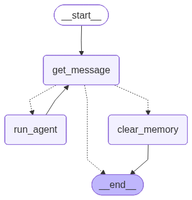

# Topic 3: Agent Tool Use Portfolio

This repository documents my end-to-end implementation for Topic 3. The work progresses from local model inference and API setup into manual tool calling, LangGraph tool orchestration, persistent conversation memory, and a design-level parallelization analysis.

## Table of Contents

- [Overview](#overview)
- [Environment and Setup](#environment-and-setup)
- [Task 1: Ollama + Performance Experiments](#task-1-ollama--performance-experiments)
- [Task 2: OpenAI Setup and API Verification](#task-2-openai-setup-and-api-verification)
- [Task 3: Manual Tool Handling](#task-3-manual-tool-handling)
- [Task 4: LangGraph Tool Handling](#task-4-langgraph-tool-handling)
- [Task 5: Persistent Conversations](#task-5-persistent-conversations)
- [Task 6: Design Discussion - Parallelization](#task-6-design-discussion---parallelization)
- [How to Run](#how-to-run)
- [Project Structure](#project-structure)
- [Conclusion](#conclusion)

## Overview

Core outcomes from this assignment:

1. Migrated MMLU evaluation calls to an Ollama OpenAI-compatible endpoint.
2. Measured sequential vs parallel execution impact on wall-clock runtime.
3. Verified OpenAI API setup and explained the essential completion call structure.
4. Added and validated a calculator tool in a fully manual tool-calling loop.
5. Extended the LangGraph/LangChain tool agent with multiple tools and scalable dispatch.
6. Implemented checkpoint-backed persistent conversation recovery and memory clearing.
7. Identified a concrete remaining optimization opportunity: parallel tool execution.

## Environment and Setup

- Local laptop environment (not Colab)
- API key stored in shell profile as `OPENAI_API_KEY`
- Python package management via `uv`
- Main tool-use model: `gpt-4o-mini`
- Task 1 local inference endpoint: Ollama (`/v1` OpenAI-compatible route)

## Task 1: Ollama + Performance Experiments

### Implementation changes

I modified the Topic 1 MMLU script to call an Ollama server through the OpenAI client.

```python
client = OpenAI(
    base_url=f"{os.environ.get('OLLAMA_HOST', None)}/v1", api_key="ollama"
)
```

I also implemented an Ollama prediction helper that extracts a single multiple-choice letter robustly:

```python
def get_ollama_prediction(client, prompt):
    resp = client.chat.completions.create(
        model=MODEL_NAMES[0],
        messages=[{"role": "user", "content": prompt}],
        temperature=0,
        max_tokens=MAX_NEW_TOKENS,
    )
    text = resp.choices[0].message.content
    answer = text.strip()[:1].upper()

    if answer not in ["A", "B", "C", "D"]:
        for char in text.upper():
            if char in ["A", "B", "C", "D"]:
                answer = char
                break

    return answer
```

### Timing methodology

I timed two single-topic runs (`astronomy` and `anatomy`) using shell-level `time`.

Sequential:

```bash
time bash -c 'python3 llama_mmlu_eval.py topics set astronomy > /dev/null 2>&1; \
              python3 llama_mmlu_eval.py topics set anatomy   > /dev/null 2>&1'
```

Parallel:

```bash
time bash -c 'python3 llama_mmlu_eval.py topics set astronomy > /dev/null 2>&1 & \
              python3 llama_mmlu_eval.py topics set anatomy   > /dev/null 2>&1 & wait'
```

### Results

| Execution Mode | Real Time | User Time | Sys Time |
|---|---:|---:|---:|
| Sequential | 2m 23.204s | 17.884s | 3.016s |
| Parallel | 1m 12.694s | 15.854s | 2.105s |

Interpretation: running both evaluations in parallel reduced wall-clock runtime by about 50 percent. Even with shared hardware, each job did not fully saturate resources, so concurrent execution improved overall throughput.

## Task 2: OpenAI Setup and API Verification

### Secret handling approach

Since this was completed locally, I exported my key through shell configuration (`~/.profile`) instead of notebook secrets.

### API call test

I validated OpenAI connectivity using `gpt-5-nano` in my test script and increased completion tokens to avoid premature cutoff.

```python
from openai import OpenAI

client = OpenAI()
response = client.chat.completions.create(
    model="gpt-5-nano",
    messages=[{"role": "user", "content": "Say: Working!"}],
    max_completion_tokens=512,
)
print(f"Success! Response: {response.choices[0].message.content}")
print(f"Cost: ${response.usage.total_tokens * 0.000000375:.6f}")
```

Observed run output:

```bash
$ uv run gpt4omini_test.py
Success! Response: Working!
Cost: $0.000080
```

### Explanation of required lines

- `client = OpenAI()` initializes the SDK client and reads `OPENAI_API_KEY` from the environment.
- `client.chat.completions.create(...)` sends model, message list, and token constraints to the chat completion endpoint.
- The returned `response` includes generated text in `response.choices[0].message.content` and token usage in `response.usage`.

## Task 3: Manual Tool Handling

I implemented tool-calling additions in `manual_tool_handling_new.py` by extending the starter script `manual-tool-handling.py`.

### Differences from starter code

- Added `numexpr` dependency and a `calculator(expression: str)` tool.
- Added calculator JSON schema in the OpenAI `tools` list.
- Expanded manual function dispatch from weather-only to weather + calculator.
- Added test scenarios that require calculator-only and mixed-tool reasoning.

### Calculator implementation

```python
def calculator(expression: str) -> str:
    try:
        result_numexpr = ne.evaluate(expression)
        return f"{result_numexpr}"
    except Exception as e:
        return f"Error running calculator: {e}"
```

### Tool schema addition

```python
{
    "type": "function",
    "function": {
        "name": "calculator",
        "description": "Calculate an expression using the numexpr package.",
        "parameters": {
            "type": "object",
            "properties": {
                "expression": {
                    "type": "string",
                    "description": "Expression string to be evaluated by the numexpr package.",
                },
            },
            "required": ["expression"],
        },
    },
}
```

### Validation evidence

Unit-level check (`test-calculator.py`) asserts that a simple expression evaluates correctly.

End-to-end tool traces confirmed:

- `Calculate 69 + 67` triggers calculator and returns `136`.
- Mixed query (`Is it colder in San Francisco or in London?, also calculate by how much.`) chains `get_weather` and `calculator` to produce the temperature difference.

## Task 4: LangGraph Tool Handling

I extended `langgraph-tool-handling-new.py` beyond starter behavior in `langgraph-tool-handling.py`.

### Differences from starter code

- Added three tools beyond `get_weather`:
  - `calculator_tool` (wrapper around manual calculator)
  - `count_instances_of_substring` (letter-count tool)
  - `divine_insight` (original tool using `fortune` + random lucky numbers)
- Replaced hardcoded tool dispatch with scalable dictionary-based dispatch.
- Bound all tools at once with `llm.bind_tools(tools)`.

Dispatch pattern:

```python
tools = [get_weather, calculator_tool, divine_insight, count_instances_of_substring]
tool_map = {tool.name: tool for tool in tools}

if function_name in tool_map:
    result = tool_map[function_name].invoke(function_args)
else:
    result = f"Error: Unknown function {function_name}"
```

### Behavioral evidence from tests

- Weather-only and no-tool prompts still work as expected.
- Multi-city prompt triggers multiple `get_weather` calls in one iteration.
- New original tool prompt triggers `divine_insight` successfully.
- Complex chained prompt triggers repeated tools (`get_weather`, `divine_insight`, `calculator_tool`, `count_instances_of_substring`) and demonstrates iteration-limit behavior when the agent never reaches final response within 5 iterations.

## Task 5: Persistent Conversations

Task 5 extends the agent into a persistent LangGraph application.

### Architecture and state

- State model includes:
  - `messages`
  - `sysprompt`
  - `clear_requested`
- Nodes:
  - `get_message`
  - `run_agent`
  - `clear_memory`
- Routing behavior:
  - `q` / `quit` / `exit` -> end
  - `clear` / `reset` -> clear path
  - otherwise -> normal agent run

### Checkpointing and recovery

- Persistent storage via `SqliteSaver` in `checkpoints.sqlite`
- Thread-scoped recovery using `--thread-id`
- On clear/reset, thread checkpoint is deleted to remove memory

### LangGraph diagram (generated output)



### Example persistent conversation behavior

```text
# Session 1
$ uv run langgraph-tool-handling-new.py --thread-id alpha
> My name is Blaise. Also what's the weather in London?
--- Iteration 1 ---
LLM wants to call 1 tool(s)
  Tool: get_weather
  Args: {'location': 'London'}
  Result: Rainy, 48F

--- Iteration 2 ---
Assistant: Nice to meet you, Blaise. The weather in London is rainy, 48F.

> Please remember my favorite number is 42.
--- Iteration 1 ---
Assistant: Got it. I will remember your favorite number is 42.

> quit

# Session 2 (same thread)
$ uv run langgraph-tool-handling-new.py --thread-id alpha
> What is my name and favorite number?
--- Iteration 1 ---
Assistant: Your name is Blaise, and your favorite number is 42.

> reset
Clear requested. Ending run so checkpoint memory can be cleared.
Cleared checkpoint memory for thread 'alpha'.

# Session 3 (same thread after reset)
$ uv run langgraph-tool-handling-new.py --thread-id alpha
> What is my name?
--- Iteration 1 ---
Assistant: I do not have your name yet in this conversation.
```

This verifies both recovery and explicit memory clearing.

## Task 6: Design Discussion - Parallelization

An unused parallelization opportunity exists in `run_agent` when a single model turn emits multiple tool calls. The current implementation executes them sequentially in a loop.

Potential improvement:

- Run independent tool calls concurrently (for example, weather queries for multiple cities).
- Collect all results, then append `ToolMessage` entries back to the conversation state.

Expected benefit:

- Reduced turn latency for multi-tool prompts.

Tradeoffs:

- More complex ordering/error handling and reproducibility logic.
- Higher contention risk for stateful, rate-limited, or expensive tools.

## How to Run

Install dependencies:

```bash
uv sync
```

Run manual tool-handling implementation (Task 3):

```bash
uv run manual_tool_handling_new.py
```

Run LangGraph tool/persistence implementation (Tasks 4-5):

```bash
uv run langgraph-tool-handling-new.py --thread-id default
```

Resume a prior thread:

```bash
uv run langgraph-tool-handling-new.py --thread-id alpha
```

## Project Structure

- `assign3.md`: assignment specification
- `Task1.md` to `Task6.md`: internal per-task notes and logs
- `llama_mmlu_eval.py`: Task 1 evaluation script with Ollama integration
- `gpt4omini_test.py`: OpenAI API setup validation script
- `manual-tool-handling.py`: starter manual tool-handling code
- `manual_tool_handling_new.py`: implemented manual tool-handling solution
- `langgraph-tool-handling.py`: starter LangGraph tool code
- `langgraph-tool-handling-new.py`: extended LangGraph solution with persistence
- `lg_graph.png`: generated LangGraph diagram image
- `checkpoints.sqlite`: persisted conversation state database

## Conclusion

This portfolio shows the full progression from simple model invocation to a durable tool-using agent with persistent memory. The final design is functionally complete for all six tasks, demonstrates robust multi-tool behavior, and exposes a clear next optimization path through concurrent tool execution.
