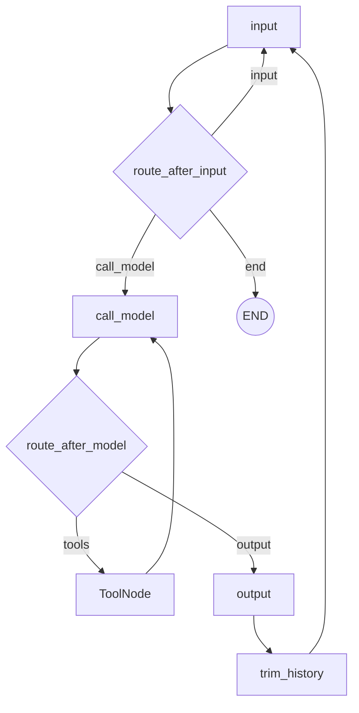
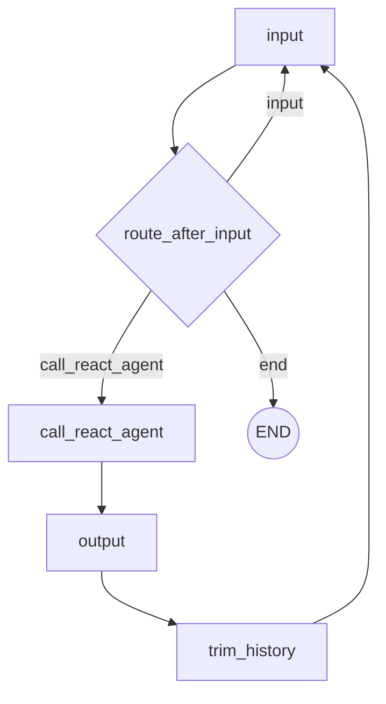

# Topic 4: Exploring Tools Portfolio

This directory captures my Topic 4 work on comparing `ToolNode` and `create_react_agent`, then applying those patterns in a small multi-tool research assistant project.

## Table of Contents

- [Overview](#overview)
- [Environment and Setup](#environment-and-setup)
- [Part 1: ToolNode vs ReAct Analysis](#part-1-toolnode-vs-react-analysis)
- [Part 2: 2-Hour Agent Project (Wikipedia + DuckDuckGo)](#part-2-2-hour-agent-project-wikipedia--duckduckgo)
- [Mermaid Graphs](#mermaid-graphs)
- [Example Terminal Outputs](#example-terminal-outputs)
- [How to Run](#how-to-run)
- [Project Structure](#project-structure)
- [Conclusion](#conclusion)

## Overview

For this assignment I completed both the architecture comparison and an implementation project:

1. Studied and compared a manual `ToolNode` graph against a `create_react_agent` graph.
2. Answered the four required design/comparison questions from the assignment prompt.
3. Built a persistent multi-turn agent project using Wikipedia + DuckDuckGo retrieval.
4. Documented runnable commands, graph structure, and representative terminal traces.

## Environment and Setup

- Python package management: `uv`
- Model provider: OpenAI (`gpt-4o`)
- Core frameworks: LangChain + LangGraph
- Retrieval tools: `WikipediaQueryRun`, `DuckDuckGoSearchResults`

Install dependencies:

```bash
uv sync
```

Set your API key:

```bash
export OPENAI_API_KEY="your_key_here"
```

## Part 1: ToolNode vs ReAct Analysis

### Q1. What Python features does `ToolNode` use for parallel dispatch, and what tools benefit most?

`ToolNode` is built around Python async execution patterns (`async`/`await`) so independent tool calls can run concurrently rather than strictly one-by-one. In practice, the biggest gains come from I/O-bound tools where latency dominates compute.

Best candidates for parallel dispatch:

- web/search tools (DuckDuckGo, Tavily, Wikipedia wrappers)
- API-backed tools (weather, market data, maps)
- database/network calls that do not depend on each other

Tools that mutate shared state or have strict sequencing constraints are less ideal for parallel fan-out.

### Q2. How do both programs handle special inputs like `verbose` and `exit`?

Both implementations use the same command pattern:

1. `input_node` parses user input.
2. It sets a `command` field in state for special commands.
3. A conditional router checks `command` and branches:
   - `exit`/`quit` -> `END`
   - `verbose`/`quiet` -> loop back to input (toggle tracing)
   - normal message -> continue through agent path

This avoids polluting conversation history with sentinel control messages.

### Q3. How do the graph diagrams differ?

The `ToolNode` graph explicitly shows the tool-execution loop:

- `input -> call_model -> tools -> call_model -> ... -> output -> trim_history -> input`

The `create_react_agent` wrapper graph is simpler at the top level:

- `input -> call_react_agent -> output -> trim_history -> input`

Tool reasoning still happens, but it is encapsulated inside the prebuilt ReAct agent internals rather than represented as first-class nodes in my outer graph.

### Q4. When is `create_react_agent` too restrictive and `ToolNode` is preferable?

I would choose `ToolNode` when I need direct control over the reasoning loop and routing, for example:

- custom stopping policies and iteration guards
- branch logic based on tool result classes
- human approval gates before specific tool invocations
- specialized retry/backoff for only certain tools

`create_react_agent` is excellent for fast, clean defaults, but `ToolNode` gives more control when workflow policy is part of the assignment or product behavior.

## Part 2: 2-Hour Agent Project (Wikipedia + DuckDuckGo)

I implemented Option 1 from the assignment prompt: a research assistant that can combine two external information sources.

### What I built

File: `main.py`

- Added a persistent conversation graph that loops in-graph (no Python while-loop).
- Added tools for:
  - `wikipedia(query)`
  - `ddg(query)`
  - `get_weather(location)`
  - `get_population(city)`
  - `calculate(expression)`
- Added command-based control (`verbose`, `quiet`, `exit`).
- Added automatic history trimming after 100 messages.
- Added graph image generation for the conversation wrapper and ReAct internals.

### Why this demonstrates Topic 4 goals

- It shows abstraction with `create_react_agent` while still using explicit graph nodes for conversation lifecycle.
- It demonstrates multi-tool composition across different backends.
- It keeps stateful behavior clean through typed graph state and controlled routing.

## Mermaid Graphs

### ToolNode-style graph



### ReAct wrapper graph



Generated diagrams in this folder:

- `langchain_react_agent.png`
- `langchain_conversation_graph.png`

## Example Terminal Outputs

I saved representative run traces in:

- `toolnode_example_output.txt`
- `react_agent_example_output.txt`
- `main_project_output.txt`

## How to Run

Run the ToolNode implementation:

```bash
uv run toolnode_example.py
```

Run the ReAct wrapper implementation:

```bash
uv run react_agent_example.py
```

Run the Topic 4 project implementation (Wikipedia + DuckDuckGo):

```bash
uv run main.py
```

## Project Structure

- `topic4_assignment_dump.txt`: assignment text dump used as implementation checklist
- `toolnode_example.py`: manual model + `ToolNode` conversation graph
- `react_agent_example.py`: prebuilt ReAct agent wrapped in persistent conversation graph
- `main.py`: final project variant with Wikipedia + DuckDuckGo and additional tools
- `langchain_react_agent.png`: internal ReAct graph export
- `langchain_conversation_graph.png`: wrapper conversation graph export
- `toolnode_example_output.txt`: ToolNode run transcript excerpt
- `react_agent_example_output.txt`: ReAct run transcript excerpt
- `main_project_output.txt`: project run transcript excerpt

## Conclusion

This Topic 4 submission demonstrates the progression from graph-level tool orchestration (`ToolNode`) to a higher-level ReAct abstraction, then applies those ideas in a practical multi-source research assistant. The key tradeoff is clear: abstraction gives speed, while explicit graph/tool nodes give control.
