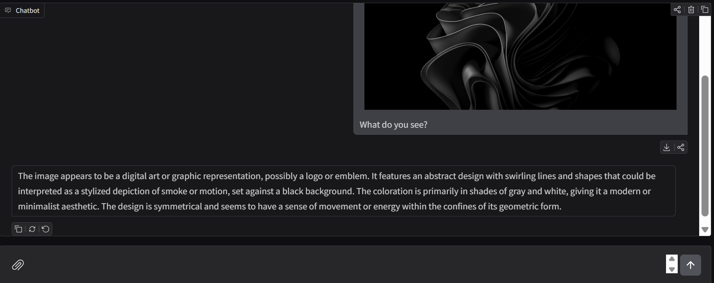
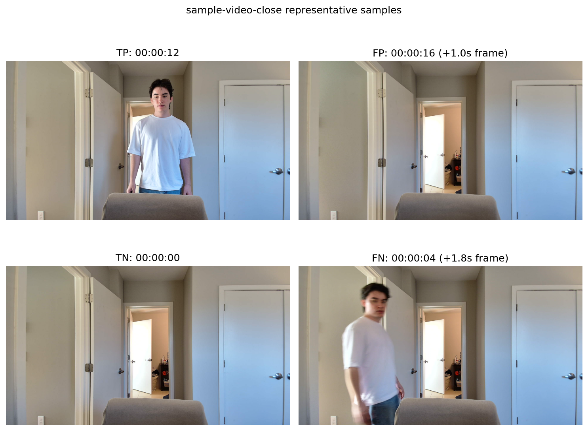
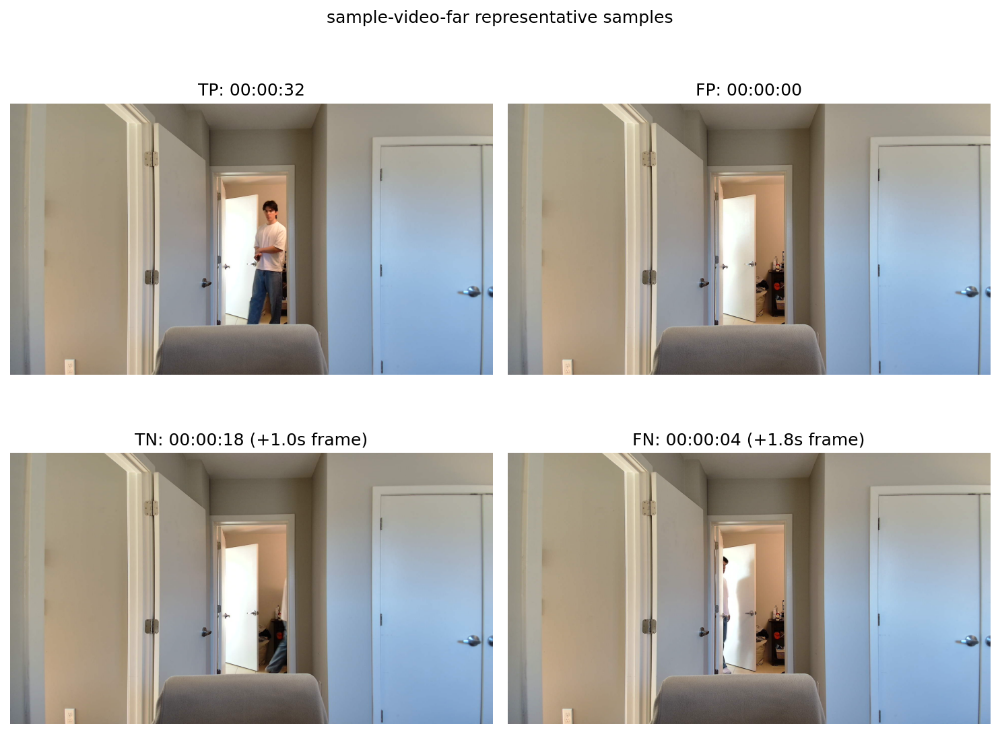

# Topic 6 VLM

This folder now contains:
- Part 1: a multi-turn, multi-image chatbot built with Gradio, LangGraph, and Ollama
- Part 2: a standalone video surveillance analyzer that samples video frames and uses LLaVA to detect when a person enters and exits the scene

## Current Status

The main working path right now is `gradio_quickstart.py`.



What is implemented so far:
- a Gradio chat UI using `gr.ChatInterface` and `gr.MultimodalTextbox`
- multi-turn conversation state through LangGraph checkpoints and a per-session `thread_id`
- multiple image uploads per turn
- image validation, resizing, and base64 conversion before model invocation
- Ollama chat calls through `langchain_ollama.ChatOllama`

What is still rough or unfinished:
- `main.py` and `agent/ui.py` are still scaffold files and are not the real app entry path
- error handling is minimal
- the graph test script needs updating for the checkpointed graph config
- Part 2 is currently a batch script, not a UI app

## Part 1 Behavior

The chatbot currently follows these rules:
- max 3 images per turn
- accepted image types: `.jpg`, `.jpeg`, `.png`
- images are resized to a maximum edge length of 720 pixels
- images are attached only to the turn where they are uploaded
- conversation history is kept in LangGraph message state for the current session
- session memory is in-memory only and does not persist across app restarts

## Architecture

- `gradio_quickstart.py`: current runnable app, Gradio session state, chat callback wiring
- `agent/state.py`: LangGraph state schema and initial state
- `agent/graph.py`: graph compilation and `InMemorySaver` checkpointing
- `agent/nodes.py`: input validation, image prep, message assembly, model call, buffer cleanup
- `agent/ollama_client.py`: Ollama wrapper using `ChatOllama`
- `util/imgUtils.py`: image resize helper
- `test/test_graph_one_turn.py`: early graph test script

## LangGraph Flow

The current graph flow is:

```text
START
-> ingest_user_turn
-> prepare_images_for_turn (if images were uploaded)
-> append_user_message
-> call_vlm
-> clear_turn_buffers
-> END
```

If validation or model execution sets an error, the graph routes through `handle_error` before clearing turn-local buffers.

## Running It

1. Start Ollama locally.
2. Make sure a vision-capable model is available. The current default is `llava`.
3. Install dependencies.
4. Run the Gradio app from this directory.

Example:

```bash
uv sync
ollama pull llava
uv run python gradio_quickstart.py
```

By default, Ollama is expected at `http://localhost:11434`. You can override that with `OLLAMA_HOST`.

## Part 2

The standalone Part 2 script is `llava_video_surveillance.py`.

What it does:
- opens a local video file with OpenCV
- samples one frame every 2 seconds by default
- downscales large frames before inference
- asks LLaVA whether a person is present in each sampled frame
- reports enter and exit timestamps based on presence transitions

Example:

```bash
uv run python llava_video_surveillance.py path/to/video.mp4 --verbose
```

Optional flags:
- `--sample-seconds 2.0`
- `--max-dimension 720`
- `--model llava`

## Part 2 Evaluation Notes

The sample-video evaluation artifacts live in `analysis/video_eval/`.

- close-scene grid: `analysis/video_eval/sample-video-close-confusion-grid.png`
- far-scene grid: `analysis/video_eval/sample-video-far-confusion-grid.png`
- report: `analysis/video_eval/report.md`





What the evaluation suggests:
- the close and far videos both show noisy predictions around transition windows rather than clean single enter/exit pairs
- the far-camera setup is much harder for the current detector than the close-camera setup
- a noisy background plus frame downscaling can remove detail that a small local vision model needs to reliably distinguish a real person from clutter or partial motion
- this combination can lead to both false positives in busy intervals and false negatives when the person is small, distant, or only partially visible
- the exported grids make that tradeoff visible by showing representative TP, FP, TN, and FN frames for each sample video

## Notes And Limits

- The app seeds `initial_state()` on the first turn of a Gradio session, then relies on LangGraph checkpoint state for later turns.
- The current implementation uses LangChain message objects instead of a custom raw Ollama message-dict layer for easier interfacing with LangChain's `ChatOllama` wrapper.

## Not Yet Done

- durable chat persistence
- polished user-facing error messages
- a finished `main.py` launch path
- a finished `agent/ui.py` app (currently launches and manages ui via gradio_quickstart)
- optional Part 2 features like webcam mode and animal counting
