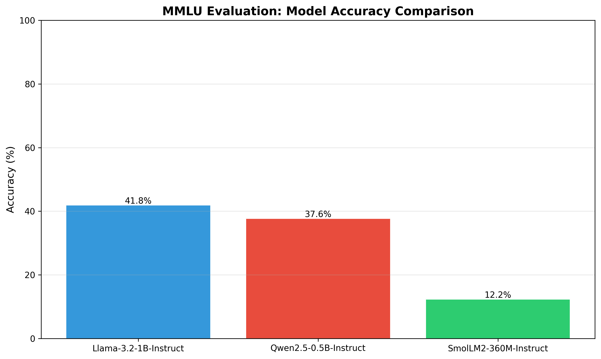
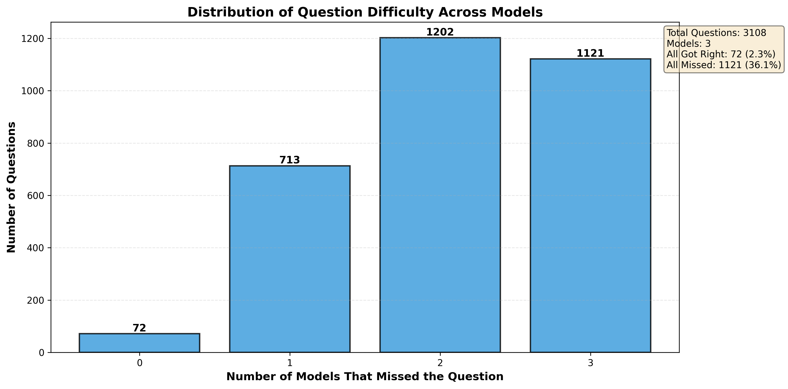
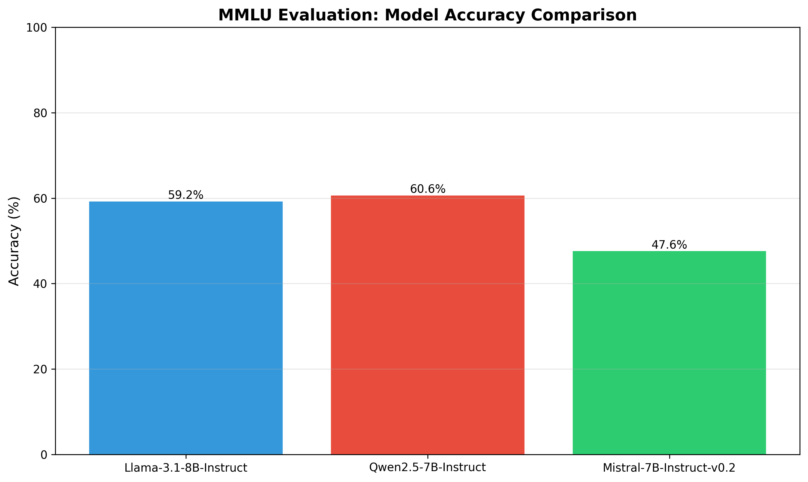
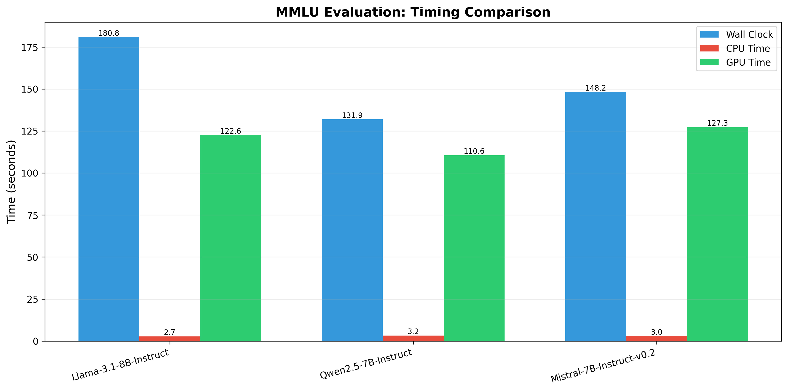

# Running an LLM

**Author:** Blaise Duncan  
**Date:** January 18, 2026

## 📂 Repository Info & Usage

This repository contains the code and deliverables for the "Running an LLM" workshop. It includes scripts for benchmarking Large Language Models on the MMLU dataset and a custom implementation of a context-aware Chat Agent with optional stateless operation.

### Installation
Create and activate a virtual environment, then install dependencies from `requirements.txt`:
```bash
python -m venv .venv
source .venv/bin/activate
pip install -r requirements.txt
```

### Running the Benchmark
To evaluate a model (e.g., Llama 3.2 1B) with verbose logging:
```bash
python llama_mmlu_eval.py --model-name "meta-llama/Llama-3.2-1B-Instruct" --verbose
```

### Running the Chat Agent
The chat agent supports two modes of operation controlled via environment variables.

**1. Context-Aware Mode (Default):**
```bash
python simple_chat_agent.py
```

**2. Stateless Mode (Disabled History):**
```bash
DISABLE_HISTORY=true python simple_chat_agent.py
```

---

# Lab Report: Running and Evaluating LLMs

## 1. Overview
This report details the evaluation of Large Language Models (LLMs) on the MMLU benchmark using both local resources and Google Colab. It compares accuracy and timing across model sizes and details the implementation of a memory-managed Chat Agent capable of both long-context summarization and stateless operation.

## 2. Part 1: Local Evaluation (Small Models)
The evaluation script was run locally on three small-scale models ($\leq$ 1B parameters).

### Results
The Llama 3.2 1B model served as the baseline, achieving the highest accuracy among the small models at 41.8%. The smallest model, SmolLM2-360M, struggled significantly with the complex MMLU tasks.


*Figure 1: Accuracy comparison of small models running locally.*

### Error Analysis
An analysis of question difficulty reveals that errors were not random. As shown in Figure 2, a significant portion of questions were missed by *all three* models. This suggests that certain MMLU subjects (like Professional Law and Math) are fundamentally too difficult for models in this weight class, regardless of architecture.


*Figure 2: Distribution of missed questions. The high bar on the right (3 models missed) indicates high overlap in failure cases.*

## 3. Part 2: Colab Evaluation (Medium Models)
Larger models (7B-8B parameters) were evaluated using Google Colab's A100 GPU infrastructure.

### Results
There was a marked improvement in accuracy compared to the local run, with Qwen2.5-7B and Llama-3.1-8B both achieving approximately 60% accuracy.


*Figure 3a: Accuracy Comparison (Colab)*


*Figure 3b: Timing Comparison (Colab)*

**Timing Analysis:** Qwen2.5-7B proved to be the most efficient, delivering the highest accuracy (60.6%) with the lowest inference time (132s), outperforming Llama-3.1-8B which took 181s for slightly lower accuracy.

## 4. Part 3: Code Implementation

### Benchmarking with Timing
The evaluation script was modified to capture granular timing metrics using `torch.cuda.Event` to separate GPU inference from CPU overhead.

```python
def get_model_prediction(model, tokenizer, prompt):
    """Get model's prediction for multiple-choice question with timing"""
    cpu_start = time.process_time()
    inputs = tokenizer(prompt, return_tensors="pt").to(model.device)
    cpu_time_seconds = time.process_time() - cpu_start
    
    gpu_time_seconds = 0
    gpu_start_event = None
    gpu_end_event = None
    if torch.cuda.is_available() and model.device.type == "cuda":
        torch.cuda.synchronize()
        gpu_start_event = torch.cuda.Event(enable_timing=True)
        gpu_end_event = torch.cuda.Event(enable_timing=True)
        gpu_start_event.record()
    
    with torch.no_grad():
        outputs = model.generate(
            **inputs,
            max_new_tokens=MAX_NEW_TOKENS,
            pad_token_id=tokenizer.eos_token_id,
            do_sample=False,
            temperature=1.0
        )
    
    if gpu_start_event and gpu_end_event:
        gpu_end_event.record()
        torch.cuda.synchronize()
        gpu_time_seconds = gpu_start_event.elapsed_time(gpu_end_event) / 1000.0
    
    return answer, cpu_time_seconds, gpu_time_seconds
```

### Verbose Output Logging
To enable better analysis of model failures, I added a logging feature to capture questions, model answers, and correctness.

```python
# Write verbose output if enabled
if verbose_output and verbose_file_handle:
    verbose_file_handle.write(f"\n{'='*70}\n")
    verbose_file_handle.write(f"Subject: {subject} | Question {total}\n")
    verbose_file_handle.write(f"{'='*70}\n")
    verbose_file_handle.write(f"Q: {question}\n\n")
    for i, choice in enumerate(choices):
        verbose_file_handle.write(f"  {['A','B','C','D'][i]}. {choice}\n")
    verbose_file_handle.write(f"\nModel Answer: {predicted_answer}\n")
    verbose_file_handle.write(f"Correct Answer: {correct_answer}\n")
    verbose_file_handle.write(f"Result: {'✓ CORRECT' if is_correct else '✗ WRONG'}\n")
    verbose_file_handle.flush()
```

### Chat Agent Context Management
I implemented a **Summarization Strategy** to handle contexts exceeding 6000 tokens by condensing the "middle" history while preserving the system prompt and the last 5 messages. This uses a dedicated summarization prompt to compress earlier context into a single message.

Additionally, a **Stateless Mode** was added via a `DISABLE_HISTORY` flag. When enabled, only the system prompt and the current user input are sent to the model, preventing the agent from "remembering" previous turns.

```python
SUMMARIZATION_PROMPT = (
    "Summarize the previous provided conversation history in up to 2000 words. "
    "Capture high level objective of conversation and key details."
)
SUMMARY_THRESHOLD = 6000

def manage_context(chat_history):
    current_tokens = count_tokens(chat_history)
    if current_tokens > SUMMARY_THRESHOLD:
        print("Hit summary threshold.")
        # We need: System (1) + at least 1 message to summarize + Recent (5) = 7 messages
        if len(chat_history) >= 7:
            print("📊 Context threshold exceeded. Summarizing older history...")
            # Summarize everything between system prompt and last 5 messages
            summary_content = get_summary(chat_history[1:-5])

            # Construct new history: [System, Summary, Recent Messages]
            new_history = [chat_history[0]]
            new_history.append({
                "role": "user",
                "content": summary_content
            })
            new_history.extend(chat_history[-5:])
            return new_history
    return chat_history
```

```python
# Logic for Stateless Mode vs Context-Aware Mode
if DISABLE_HISTORY:
    # Stateless: System Prompt + Current Message only
    messages_to_send = [chat_history[0], chat_history[-1]]
else:
    # Context-Aware: Entire managed history (including any summaries)
    messages_to_send = manage_context(chat_history)

input_ids = tokenizer.apply_chat_template(
    messages_to_send,
    add_generation_prompt=True,
    return_tensors="pt"
).to(model.device)
```

### Conversation Comparison (Stateless vs Persistent)

**Stateless Mode (DISABLE_HISTORY=true):**
> **You:** My name is Blaise  
> **Assistant:** Hello Blaise! It's nice to meet you.  
> **You:** What is my name?  
> **Assistant:** I don't have any information about your personal details... I don't retain any information about our previous conversations.

**Persistent History Mode:**
> **You:** My name is Blaise  
> **Assistant:** Hello Blaise! It's nice to meet you.  
> **You:** What is my name?  
> **Assistant:** I remember! Your name is Blaise.
